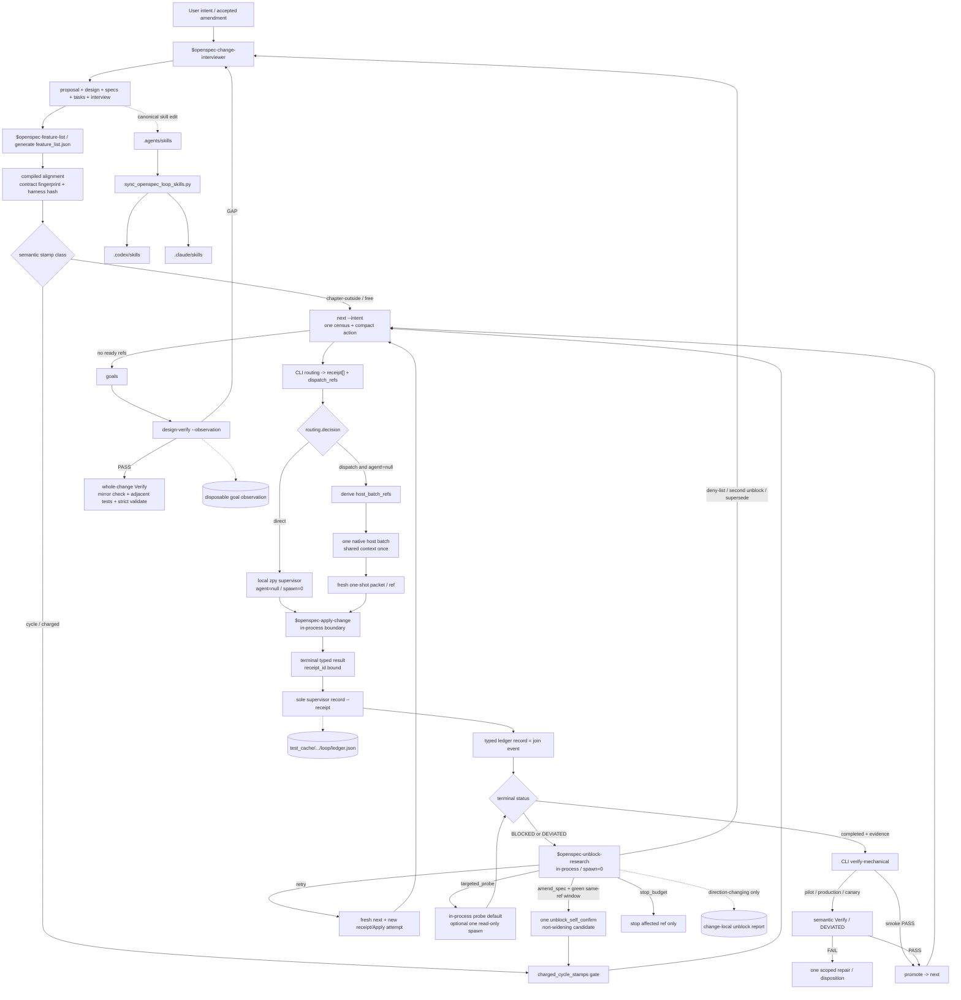

# OpenSpec Loop v3.2：运行指南、核心机制与最佳实践

本指南说明仓库当前实际使用的轻量 OpenSpec 工程 Loop。它以
`openspec-loop-engineering` 为唯一 supervisor，用 task registry 的机械指纹约束
开工，用写范围波次组织 Apply，用单一账本和 supervisor Verify 闭合结果。
`loop.json` schema 仍为 v3，receipt 仍为 v1，ledger v2 继续兼容读取；机器控制
身份升级为 `openspec-loop-control.v3.2`。v3.2 关闭无 receipt Apply record 与
promote 双普查，并加入 labeled ablation evaluator；高频 skills 仍是最多 80 行的
interface cards。

核心原则是：**合同与执行分离，普查与派出分离，worker 与最终权威分离，普通
验证与审计留痕分离。** Loop 不是 ROSE 或 `aili-delivery-flow` 操作系统，也不创建
第二套 slash、Board、`progress.txt`、worker ledger 或生命周期。

当前与兼容入口必须区分：

- **current execution**：`next → receipt-check → Apply → record --receipt →
  verify-mechanical → semantic Verify（按需）→ promote → next`；
- **CI**：`check` 只回答合同/策略是否有效；
- **debug/compatibility**：`plan` 展开完整 tasks/routing，`gate` 保留旧调用者兼容，
  不再出现在 ordinary current path；
- **semantic nodes**：Explore、semantic Verify、Unblock、interviewer 仍由模型判断，
  CLI 不取代科研语义。

实现只使用仓库现有 Python CLI、JSON/Markdown 合同与单一 ledger；借鉴 durable
workflow/reducer/interrupt 模型，但不引入 LangGraph、Temporal 或新的编排依赖。

## 1. 适用边界与权威入口

| 场景 | 入口 | 职责 | 不拥有 |
|---|---|---|---|
| 问题仍不清楚 | `openspec-explore` | 比较方案、定位证据与缺口 | Apply、Verify、promotion |
| 新建或补齐合同 | `new / continue / ff / omx-bridge` | 写 proposal、design、specs、tasks | 运行时监督 |
| 边界拷问与语义修订 | `openspec-change-interviewer` | 锁定范围、保留、路径、验收及 active registry | 产品实现、promotion |
| 有限预算执行 | `openspec-loop-engineering` | 唯一 supervisor；next、receipt、typed join、Verify、promotion | 第二生命周期 |
| 单包实现 | `openspec-apply-change --task ... --orchestrated` | 只执行一个 packet 绑定的 ref/attempt | ledger、Verify、PASS |
| 语义验收 | `openspec-verify-change --task ...` | 在 mechanical evidence 后判断 ACCEPT/DEVIATED | Apply、promotion |
| 偏离诊断 | `openspec-unblock-research` | 形成 probe 或 disposition | 自动再派、补预算 |
| false-success 检查 | `silent-failure-hunting` | 一个 ref 或 join 点的一项只读风险检查 | 生命周期、最终 Verify |
| 专项审查 | `review-pipeline` | 用户点名或一个残余风险的一次只读审查 | review swarm、PASS |
| 全量审计 | `monitor-openspec-codex` | 仅在 `retention=full` 或 legacy audit 时写 bundle | 普通 Loop 默认路径 |

upstream canonical `rose` 只保留 GitHub provenance 与 legacy/bootstrap input。
本地 supervisor-direct 的 machine Role ID 是小写 `zpy`（展示 `ZPY`），始终
non-deployable、`agent=null`、零调度人头；标签本身不提供认证或 authority。
canonical Role ID 只选择最窄能力；没有合适角色时保持 direct 或明确 `blocked`，
不得用 `general` 假装拥有任务。普通 Apply 的 implementer/test routing 由 CLI 完成；
21-role catalog 仅在 `review|explore` 的真实未决 specialist 问题中按需读取，模型不再
逐包重演扫描。

### 1.1 `e2e-host` 原子对齐索引

下表把 public guide 的每个 harness 原子义务连到当前 source、runtime 与 test。
状态为“对齐”只表示这些锚点在当前工作树一致，不替代 task/whole-change Verify。

| 原子义务 | Change / source authority | Runtime / skill surface | Mechanical evidence | Guide owner | 状态 |
|---|---|---|---|---|---|
| local `zpy` / upstream `rose` | `e2e-host` MODIFIED Requirement | `infer_candidate_role` / `route_ready_wave`；specialist scan 按需 | `test_local_zpy_direct_role_preserves_legacy_rose_bootstrap` | §1、§2.2、§3.2 | 对齐 |
| R1 bootstrap → R2/R3 local role | `e2e-host/tasks.md` R1-R3 | explicit legacy `rose` input；new direct output `zpy` | task states + local-role tests | §3.3 | 对齐 |
| `dispatch_refs` / `host_batch_refs` | Native-host requirement | `next --verbose` / plan `routing[]` + host-side filter | `test_dispatch_refs_keep_direct_zpy_refs_out_of_host_batch` | §3.2、§2.3 | 对齐 |
| receipt → typed join | Apply/join Requirement | receipt claim + `record --receipt` | `test_receipt_record_skips_nested_census_and_materializes_join` | §3.3、§2.3 | 对齐 |
| no resume / no automatic lane | packet/result MUST NOT | `Task.resume` / `resume_agent` forbidden | static handoff contract test | §3.3 | 对齐 |
| single authority writer | sole-supervisor requirement | `next` claim / `record` / mechanical Verify / promote / reseal / sync | receipt replay、scope、join tests | §3.3、§2.4 | 对齐 |
| mechanical/semantic split | TEST_LEVEL Requirement | `verify-mechanical` + Verify skill | smoke/pilot/GUI/mutation tests | §3.3.1、§6.2 | 对齐 |
| in-process ref-local unblock | blocked/deviated requirement | unblock skill，spawn=0 | `test_unblock_host_policy_is_in_process_and_ref_local` + ref-local runtime tests | §3.4、§2.3 | 对齐 |
| transmission byte proxy | native-host requirement | static UTF-8 JSON projection only | `test_static_handoff_dispatches_only_spawnable_packets` | §3.3 | 对齐 |
| canonical/mirror ownership | R3 ACCEPT | `.agents` → sync script → `.codex/.claude` | byte-exact sync tests | §2.1、§2.3 | 对齐 |
| G1 / design close | `tasks.md` G1 | `goals` + `design-verify --observation` | G1 observation + whole-change verification | §7、§2.3 | 对齐 |

## 2. Skill tree map

### 2.1 语义源与镜像树

```text
.agents/skills/                         # 唯一 canonical 语义源
├─ openspec-change-interviewer/         # 合同边界、fingerprint readiness
├─ openspec-feature-list/               # tasks -> compact active registry
├─ openspec-loop-engineering/           # 唯一 supervisor
│  └─ references/
│     ├─ canonical-roles.json           # 21 个 upstream Role ID；rose 保留 provenance
│     ├─ role-adapter-matrix.md          # Role ID -> 本地入口与写权限
│     ├─ subagent-task-packet.md         # 一个有界 dispatch envelope
│     └─ subagent-result.md              # terminal result；无最终 PASS 权限
├─ openspec-apply-change/                # packet-bound Apply interface card
│  └─ references/execution-notebook-contract.md
├─ openspec-verify-change/               # supervisor-owned semantic verdict card
│  └─ references/semantic-verification-contract.md
├─ openspec-unblock-research/            # evidence diagnosis interface card
│  └─ references/loop-disposition-gate.md # ref budget、R0/R1/R2、sink
├─ silent-failure-hunting/               # 只读 subordinate host
└─ review-pipeline/                      # 只读 subordinate host

scripts/sync_openspec_loop_skills.py     # 只做受管语义文件同步
├─ .codex/skills/                        # 机械镜像；保留平台 metadata
└─ .claude/skills/                       # 机械镜像；保留平台 metadata
```

### 2.1.1 科研 skill 检索根（无权重）

Change 可在 `loop.json.control_plane.research_skill_roots` 列出 repo-relative
skill 目录，例如领域权威 skill 与一个 notebook 工具 skill。该字段只是
intent-matched discovery hint：selected task 的 ACCEPT/TEST 明确需要对应能力时才读取
其 `SKILL.md`；不得预加载整棵 catalog，也不得给 skill 配 weights、用目录顺序改变
ref/Role 路由，或把目录存在解释成写权。

`next`、receipt、WRITE_SCOPE 与人类权限门仍是唯一执行边界。optional root 缺失只
影响真正依赖它的节点，不得阻塞无关 ready ref；外部或用户级 skill 可继续由平台
发现，但不应被复制进 change 或 feature registry。研究 change 通常只记录最小集合：
一个领域 skill，加任务明确采用时的 notebook/literature/figure skill。

Change-local 与 runtime 文件的职责也必须分开：

```text
openspec/changes/<change-id>/
├─ proposal.md / design.md / specs/** / tasks.md  # 人读 operative contract
├─ interview.md                                    # 唯一 change-local interview 决策面
├─ feature_list.json                               # compact task state
├─ loop.json                                       # fingerprint、policy、paths、budgets
└─ handoff.json                                    # 可选协调面；direct ref 不创建 agent row

loop.json.paths.ledger
└─ test_cache/<change-id>/loop/ledger.json         # thin 默认 authority ledger；非第二 spec
```

`interview.md` 是 interviewer 的正式 change-local 工件；`handoff.json` 仍是按需创建的
advisory coordination metadata。唯一 authority ledger 的字面路径来自
`loop.json.paths.ledger`，thin 默认展开为
`test_cache/<change-id>/loop/ledger.json`；worker/host 不写它。

修改 canonical skill 后只走这一条同步链：

```powershell
python scripts/sync_openspec_loop_skills.py
python scripts/sync_openspec_loop_skills.py --check
```

`--check=0` 证明受管文件字节一致，不证明 scheduler、合同测试或产品语义已经通过；
仍须运行对应 tests 和 OpenSpec 验收。

v3.2 继续把四张高频主卡锁为最多 80 行。主卡保留调用入口、typed 输出、
`DEVIATED`、`WRITE_SCOPE`、
`repair_r1` 短标记与人类权限；notebook 字段、design closing、完整 Repair Gate、
sink 和第二次 Unblock 规则只在对应节点按需读取上述 reference。细则下沉不改变
runtime authority，也不能让 reference 绕过 receipt。

### 2.2 调用与不调用关系

```text
explore -> new|continue|ff -> change-interviewer -> feature-list
tasks + feature_list.json + loop.json
  -> loop-engineering (sole supervisor)
     -> deterministic CLI routing
        -> direct: zpy (local, non-deployable, agent=null)
        -> dispatch: receipt-check -> apply-change -> typed record/join
                    -> mechanical Verify -> optional semantic Verify -> promote
     -> BLOCKED|DEVIATED -> unblock-research
        -> retry|targeted_probe | interviewer/full_auto amendment | stop_budget
     -> advisory only: silent-failure-hunting | review-pipeline
     -> retention=full|explicit audit: monitor-openspec-codex
```

| Caller | 可调用 | 返回给谁 | 明确不得调用/拥有 |
|---|---|---|---|
| interviewer | feature-list、strict validation、next | Loop supervisor | Apply、Verify、promotion |
| Loop supervisor | apply、verify、unblock；必要时两个 review host | 自己完成 join 与处置 | ROSE/delivery-flow supervisor、第二 ledger |
| apply | owner tests；packet 内瞬时重试 | Loop supervisor | verify、promote、ledger、另一个 ref |
| verify | 已 join 证据与完整 `TEST:` | Loop supervisor | Apply、worker 调度、自动修复 |
| unblock | 判别 probe 与 disposition | Loop supervisor/interviewer | 自动再派、自动扩 scope、补充次数 |
| review hosts | 一个 bounded 只读问题 | Loop supervisor | 彼此串联、review fan-out、最终 PASS |

`handoff.json` 是 change 内唯一 worker 协调面。`agents/<agent-id>` 是 packet 中的
逻辑地址，不是仓库目录、skill、slash command 或持久 agent 生命周期。

### 2.3 Harness graph：workflow、skill 与 host tool 流

下图表达 current execution authority 和 adapter boundary。`host_batch_refs` 由 active
`next` 的 authoritative receipts 派生；helper 不创建第二个 host-batch runtime object。
direct `zpy` 与 host packet 最终都回到同一个 supervisor。



纯文本等价流，供不渲染 Mermaid 的 preview 使用：

```text
interviewer
  -> proposal/design/specs/tasks/interview
  -> feature_list -> compiled fingerprint/harness alignment -> semantic stamp classification
  -> next --intent -> one census -> routing[] + typed receipts
     ├─ direct zpy (agent=null) -------------------------------┐
     └─ filter decision=dispatch && agent!=null                |
        -> host_batch_refs -> one host batch -> one-shot packet|
                                                               v
                receipt-check -> apply-change -> terminal typed result
                  -> supervisor record(apply, receipt) = join
                     ├─ completed -> mechanical verify
                     |    ├─ smoke PASS -> promote -> next
                     |    └─ pilot/production/canary -> semantic Verify
                     └─ BLOCKED|DEVIATED -> in-process unblock
                           ├─ retry -> fresh next/receipt
                          ├─ targeted_probe -> in-process default
                           ├─ first amend + green window -> one charged self-restamp
                           ├─ deny-list/second unblock/supersede -> interviewer
                          └─ stop_budget -> affected ref only
  -> no ready refs -> goals -> design-verify(observation)
     -> whole-change verify + mirror check + strict validate
```

### 2.4 Skill → tool → artifact 原子调用表

| 阶段 | Skill / capability | Tool 或 CLI | 读取的 authority | 产出 / 写者 | 下一步 |
|---|---|---|---|---|---|
| 合同修订 | `$openspec-change-interviewer` | `openspec validate`、feature generator、confirmed semantic `reseal` | proposal/design/specs/tasks + user decision | contract、`interview.md`、registry/fingerprint；interviewer/supervisor 写 | `next --intent drain` |
| Stamp admission | sole Loop supervisor | semantic `reseal` / `apply-revision` | ACCEPT、current chapter、ledger work state、`stamp_state` | admitted fingerprint + free/charged decision；supervisor 写 | `next` |
| 完整性锁 | compiled CLI | `next`、`receipt-check` | tasks/feature/loop + machine harness contract | one census、compact action、typed receipt | selected action |
| direct 分支 | local `zpy` | same-process Apply boundary | receipt route/scope | 无 agent envelope；terminal typed result | `record --receipt` |
| host 分支 | Codex/Cursor native adapter | filter `host_batch_refs`，fresh Task/spawn | authoritative receipt where `agent!=null` | 一个 batch、每 ref 一个 typed result | `record --receipt` |
| Apply | `$openspec-apply-change` | receipt-check + scoped edit | 一个 ref/attempt receipt | changed files + terminal typed result | supervisor `record` |
| Authority close | sole Loop supervisor | `record --receipt` | terminal result + receipt | `ledger.json` typed join state | mechanical Verify |
| Mechanical Verify | compiled CLI | `verify-mechanical` | joined Apply + exact TEST Run | hashes/exit/status，0 Apply | promote 或 semantic Verify |
| Semantic Verify | `$openspec-verify-change --task` | direction/DEVIATED only | ACCEPT + mechanical evidence | `PASS|FAIL|BLOCKED|DEVIATED` | promote 或 disposition |
| 偏离诊断 | `$openspec-unblock-research` | in-process probe，默认 `return_only` | expected/observed + ref-local counters | disposition；仅改变方向时写 `unblock/` | retry / interviewer / ref stop |
| Task state | Loop supervisor | `promote` / `sync` | verifier PASS / compact index | checkbox + feature state；原子 transition | `next` |
| Design close | Loop supervisor + verifier | `goals`、`design-verify --observation` | GOAL/COVERED_BY + disposable observation | `PASS|GAP`；不凭 task checkbox 推断 | final Verify 或 interviewer |
| Mirror | canonical `.agents` source | `sync_openspec_loop_skills.py [--check]` | `.agents/skills/**` | `.codex/.claude` mirrors；不生成 `.cursor` projection | behavior tests |
| Final | whole-change verifier | adjacent pytest + mirror check + strict validate | passed refs + design PASS | final verdict/evidence；不新增 Apply | archive decision |

## 3. 核心设计机制

### 3.1 Start-work latch：机械指纹，不是用户手印

普通 Apply 的开工条件只有三项：

1. active task registry 存在且可解析；
2. `loop.json.contract_fingerprint` 与当前 registry 一致；
3. 没有 `pending_irreversible_policy`。

`seal-preview.md`、`confirmed_at`、legacy `sealed` 字段和
`seal --confirmed` 都不是普通开工门。缺少 `loop.json` 时，active `next` 可以从
change 已记录的 `thin` retention/path decision 与仓库有限默认自动写入：

- 当前 `contract_fingerprint` 与 `narrative_digest`；
- `autonomy: supervised` 与 `retention: thin`；
- 每个 active ref 的 `max_apply_attempts=2`、`max_unblock_runs=2`；
- 已记录路径及有限测试/执行策略。

自动初始化只写 policy file，不创建 ledger、scratch、cache、product、bundle 或
GUI/Colab 目录，也不授权不可逆操作。第一次 Apply 因此不需要 stamp。

只有以下不可逆政策需要人类明确确认：提高已记录的可选 `hard_ceiling`，改变
retention、paths 或 scope，破坏性外部写入，凭据，产品 `--commit`，以及 `git push`、PR 或
`main` 操作。`seal-preview.md` 可在这条分支上作为 change-scoped 可选审计诊断，
不能反过来成为第二次开工仪式。

### 3.2 Census → wave → dispatch：普查、拓扑与实际派出分层

`next` 一次调用完成 census、routing 与 action selection；`plan` 仅保留 verbose
兼容/debug 视图。下列概念由同一 `build_plan_payload` 计算；compact next 只投影执行
所需子集：

| 字段 | 含义 | 可被什么缩小 |
|---|---|---|
| `selected_batch` | dependency-ready 的完整普查集 | 依赖、环、局部合同错误、终态 |
| `selected_wave` | 通过四问后的完整写范围独立 Apply 集 | 写范围重叠、包不合格、无稳定 join |
| `apply_remaining` | `selected_wave` 内 per-ref Apply 余量仍为正的 ref 数 | 各 ref 的 `max_apply_attempts` 与已记录 Apply 使用量 |
| `allowed_parallel_applies` | `min(|selected_wave|, apply_remaining)`；plan/debug 字段，current next 以 `receipts` 数表达 | 只由上述两项计算 |
| `dispatch_refs` | 本轮实际可派出的确定性顺序 | per-ref allowance、可选 active minutes/breakers、写拓扑 |

`dispatch_refs` 同时容纳 supervisor-direct 与可 spawn refs。native host 必须再派生：

```text
host_batch_refs =
  dispatch_refs where routing.decision == dispatch and agent != null
```

direct `zpy|rose` ref 即使位于 `dispatch_refs` 也留在 supervisor 本进程；一波最多
一个 native host batch，每个 `host_batch_ref` 最多一个 fresh one-shot packet。

每个候选包进入 `selected_wave` 前回答四问：

1. 包是否有界且非平凡？
2. 是否选择最窄 canonical Role ID？
3. 写范围是否与同波其他包不相交？
4. 是否有稳定的 supervisor-owned join id？

`selected_wave` 可以宽于 2，也不因 `apply_remaining=0` 被清空。余量为零时只是
`dispatch_refs=[]`，普查和波仍保留供诊断与后续排水。`host_soft_cap`、
`max_subagents`、distinct runtime id、Role ID 数量和只读 worker 数量只可作为
兼容诊断，不得过滤波、消耗 Apply 或制造 stop。

写范围相交时，把后一个 ref 放到下一波、串行 Apply 或 supervisor direct；这叫
拓扑约束，不叫人头闸。未知依赖和环只影响相关 ref，不应清空独立 ready siblings。

`next --shadow` 是只读迁移面：不初始化 policy、不授予执行权，只报告与 legacy
plan 的 parity 和 ablation 指标。active `next` 为每个 Apply ref 生成 machine receipt，
绑定 contract fingerprint、`harness_contract_hash`、ref/attempt、Role、WRITE_SCOPE、
join/wave、TEST_LEVEL。receipt 不是身份认证；其权威来自 sole supervisor，runtime 用它
消除 worker preflight 与 `record` 中的重复 census。active next 在现有唯一 ledger 中
登记 compact control event 与 issued claim；record 原子消费一次，shadow 不登记，重放
被拒绝。
默认 `next` 只输出 counts、当前 action/ref、短 opaque receipt id 和必要 blockers；
`--verbose` 才展开完整 terminal/task/routing diagnostics，避免大 registry 反复进入模型
上下文。

#### 3.2.1 Current CLI output contract

`next` 使用 `openspec-loop-next.v1`，`next_action` 只可能是：

```text
apply | verify_mechanical | verify_semantic | promote | unblock |
repair | interview | review | explore | wait_join | design_verify | stop
```

关键字段：

- `contract_fingerprint` + `harness_contract_hash`：合同与 machine control 双锁；
- `selected_ref`、`selected_batch`、`selected_wave`、`dispatch_refs`：当前 census/route；
- `census.{task,ready,blocked,terminal}_count`：默认紧凑状态；
- `receipts[]`：仅 `apply` action 产生；active token 是 20 字符 opaque id，shadow
  `token=null` 且 `authoritative=false`；
- `issues/warnings/action_reasons`：决定是否进入 interview/wait/stop；
- `shadow_parity` 与 `ablation`：迁移一致性、census、routing source、card bytes。

`receipt-check` 使用 `openspec-loop-receipt-check.v1`，返回 `valid`、`authoritative`、
`claim_state=issued|consumed` 与不展开 WRITE_SCOPE 的 compact receipt。只有
`valid=true && authoritative=true && claim_state=issued` 可进入 Apply。
`record --receipt` 返回唯一 `receipt_id` 和 `join.{state,pending_refs,
verify_eligible}`；receipt 被消费后不可重放。
v3.2 不再允许 CLI 新建无 receipt Apply record：缺失 receipt 在 task lookup、plan
或 ledger write 前返回 `apply_record_requires_receipt`。旧 ledger 的 `legacy:*`
记录继续可读/可汇总，但不能作为新写入口。

### 3.3 Authority 与记账：1 worker = 1 ref = 1 Apply record

每个 Apply dispatch 都创建一份 fresh packet，至少固定：Package ID、Role ID、
local entry、ref、Apply attempt、assignment、acceptance boundary、scope、forbidden
scope、allowed actions、write scope、expected result/evidence、execution、join 和
stop conditions。

一个 Apply worker 只能绑定一个 active ref 和一个 supervisor-owned attempt。
worker 可以在不改变 packet 的前提下多轮使用工具、运行最小检查，并对 429、超时
等瞬时工具/进程故障作包内重试；它不能合并另一 ref、写 ledger、promote、勾选
task 或宣称 PASS。

terminal typed result 返回后，只有 supervisor 可用原 receipt 写该 ref/attempt 的一条
canonical Apply record；该 record 本身就是 join event，重复 `attempt_id` 被拒绝。
Goal、stop hook、只读研究/审查、mechanical/semantic Verify、`zpy` direct routing、
explicit legacy `rose` bootstrap 和 Verify evidence inspection 都是 0 Apply、0 调度
人头。

每个 native host packet 使用 fresh one-shot task/thread；terminal result 关闭上下文并
携带 `RESULT_SCHEMA + RECEIPT_ID`。自然语言 next/handoff 字段没有控制权。
`Task.resume`、`resume_agent`、continuation 字段，以及 implementation 完成后自动追加
review/test/security/coverage/Verify lane 都被禁止。Loop 自己复用
supervisor `run_id` 只是 ledger lineage，不等于恢复 host task/thread。

只有 sole supervisor 可以调用 active `next` 签发 claim、写 `record(apply|unblock)`、
消费 join、选择 semantic Verify、`promote`、`reseal` 与 `sync`。worker 可只读调用
`receipt-check`，但不能签发/消费 claim。native host、result、handoff row 与 unblock
disposition 都只是输入；它们不能写 `ledger.json`、task/feature state、第二 ledger、
Board 或 `progress.txt`。legacy `gate` 仍可被旧调用者使用，但不是 current path 的
第二 supervisor。本合同不引入 ledger CAS/lock；single-process authority 与
cross-process locking 是两个不同问题。

传输效率使用稳定的 UTF-8 JSON 代理，不读取 provider-specific token API：

```text
transmission_bytes =
  shared_context_bytes + Σpacket_delta_bytes + Σresult_bytes
```

静态投影只把 fingerprint、join id 与 write-disjoint 声明计入一次 shared context；
packet/result 部分只计 ref-local 投影。这个公式是 evaluation proxy，不是新的 delta
encoding protocol，也不表示 helper 已经拥有 host-batch runtime object。

迁移顺序是兼容事实，不是当前分支：R1 曾以 explicit legacy `rose` bootstrap local
`zpy` support；R2/R3 及之后的新 direct output 使用 `zpy`。任何新任务不得因这段
历史说明重新发射 `rose`。

写权限按最窄 Role ID 固定：`implementer` 只写 task-owned 产品/合同文件，
`test-engineer` 只写 task-owned 测试，`browser-qa-runner` 与
`e2e-artifact-runner` 只写合同批准的 evidence root；其他 dispatched roles 只读。

#### 3.3.1 Mechanical 与 semantic Verify 分层

Task 可选声明 `TEST_LEVEL: smoke|pilot|production|canary`，feature registry 只保存同名
紧凑字段，不升级 schema。`verify-mechanical` 只执行可机械编译的 CLI `Run:`，输出
command/stdout/stderr hash、exit code 与 typed verdict，不把大段日志写进 ledger。
含 product `--commit`、Git push/PR 或递归删除的命令仍需单独人类授权，不能因位于
TEST 中而自动执行：

- `smoke`：模块连通性；mechanical PASS 可直接形成 promotion authority；
- `pilot`：初级实验产物；mechanical PASS 后仍需 semantic Verify；
- `production`：正式生产产物；保留完整 outcome/source/schema/direction 判断；
- `canary`：回归或差分验证；机械比较先行，偏差仍由 semantic Verify 判定；
- 未声明的 legacy task：fail-closed，按需要 semantic Verify 处理。

`summary.ablation` 报告实际 misroute、false-success、semantic deviation、
control/work hops、CLI control calls 与当前 supervisor card bytes；live CLI 看不到
skill 内部模型调用，所以 `llm_control_call_count=0` 必须同时标记
`llm_control_visibility=false`。真实 DEVIATED 检出率与同 ACCEPT 跨-run 一致性只由
`ablation-evaluate --manifest` 的 labeled ordered events 计算；无正例或无重复组时
rate 为 `null`，不能用事件占比冒充。比较旧链与新链时继续记录 prompt bytes、
census、误路由和 false-success，不用主观“更快”代替证据。

### 3.4 Join 与 retry：本波/本 ref 闭合，三类主人分开

同一 worktree 的实际派出成员必须全部返回 terminal result 并形成 typed join，
supervisor 才能对本轮任一 ref 开始 mechanical Verify。barrier 只覆盖 receipt 的
`wave_refs`（即实际 `dispatch_refs`），不是等待尚未派出的
`selected_wave` 尾部，更不是等待全 change。barrier 关闭后，每个 ref 仍按自己的
结果判断：只有 `completed` 且证据可检查者可 Verify；失败 sibling 只阻塞自己。
独立 worktree 可按自己的 join 闭合；无关 explore、只读 review 和不受本波写入
影响的工作不必空等。

三类重试/再派主人不得混写：

- **worker 内部重试（允许）**：terminal result 前的瞬时工具/进程故障；packet
  不变，仍是一轮 Apply；
- **supervisor 新 Apply（允许但须新 receipt）**：旧结果完成处置后，只有 active
  `next` 检查该 ref 的 `max_apply_attempts`、已激活的 `max_unblock_runs`、可选 active
  minutes 与 breakers 并签发 fresh claim，才创建新 packet/attempt；
- **自动再派（禁止）**：terminal `failed|empty|partial|blocked|deviated|unverified` 不得自动
  续跑、换 worker、扩 scope 或恢复旧上下文。

断言失败、语义错误或 packet 的 Role/ref/scope/write scope/permission/acceptance
boundary 改变，都不是瞬时重试。unblock 可以建议 `retry | targeted_probe |
amend_spec | supersede_task | stop_budget`，但由 supervisor 本进程以 spawn=0 调用，
不恢复失败 Apply，也不自行 dispatch 或追加 explorer/mapper/verifier/review lane。

Unblock host coupling 不能只写成抽象 disposition：

| Disposition | 唯一可执行动作 | Spawn / join | 明确禁止 |
|---|---|---|---|
| `retry` | supervisor 重新调用 active next，签发 fresh receipt/Apply attempt | 默认 0；later Apply 走 deterministic host filter | resume 失败 packet/thread、补 quota |
| `targeted_probe` | 默认本进程执行一个 discriminating probe | 仅显式 benefit 记录允许一个 read-only spawn，immediate join，no Verify | 自动 scout wave、实现修复 |
| `amend_spec|supersede_task` | 回 interviewer 或 authorized supervisor semantic reseal | 0 | worker 改 spec、重置 counters |
| `stop_budget` | 只停止受影响 ref | 0 | 冻结 siblings、购买第三 research agent |

Loop-light profile 固定为 `return_only`、最多 4 tool calls、4 evidence items、180s，
每 ref 每 fingerprint 最多两次 unblock。第一次是 repair decision；第二次必须有
completed second Apply 且 failure fingerprint 不同或出现新 discriminating evidence，
在默认两次 Apply 下只能给 `amend_spec|supersede_task|stop_budget`，不能再开 research
swarm。只有 direction change、durable blocker、task supersession 或用户明确要求时，
才把报告写入 change-local `unblock/`；routine result 不落盘。

### 3.5 Research Repair Gate：R0 / R1 / R2

Unblock report 可选写 `repair_class`，但它不授予写权。缺省规则为：
`retry|targeted_probe → R0`、`amend_spec → R2`，而
`supersede_task|stop_budget` 永远是 R2。

- **R0**：合同不变，supervisor 按剩余预算发 fresh Apply 或执行一个 probe；
- **R1**：ref 已显式声明 `REPAIR_POLICY: bounded-r1`、Apply 预授权为 3，且
  Unblock 以证据说明错误只在方法保护带；
- **R2**：GOAL/ACCEPT 边界、DAG/ref、spec、WRITE_SCOPE、路径、retention、预算、
  外部权限或 succession 变化，由 supervisor 以 spawn=0 进入 interviewer；Unblock
  自身只返回 disposition，不调用 interviewer。

R1 使用独立 `stamp_source=repair_r1`，不放宽既有
`unblock_self_confirm`。新 design 用单-ref marker：

```text
<!-- openspec:repair-r1-method ref=R12 start -->
...
<!-- openspec:repair-r1-method ref=R12 end -->
```

候选 tasks/design 必须位于已记录 scratch。supervisor 机械冻结 proposal/spec、
GOAL/COVERED_BY、其他 ref、DAG/角色/FILES/WRITE_SCOPE、输出路径、retention、预算与
hard ACCEPT 数量/fail-closed 条款；design 只改 marker，显式 marker ref 的 outcome-only
ACCEPT 结构不变，legacy 只允许一个无歧义的方法 section 与机械唯一的方法词替换。
每个 ref 最多一对 marker；缺失、重复、嵌套、交叉、未知 ref，以及 marker 内标题或合同
directive 都按 R2 拒绝。
selected ref 可从 blocked/deviated 转 pending；TEST 只可换 Run，SCOPE 不变且不能新增
`--commit`，其余 TEST 文本保持结构等价。

通过后一次 charged stamp 原子写 design、tasks、feature、loop，执行 strict validate 与
内部 post-write plan check；成功返回后 caller 重新 `next`，任一步失败恢复四文件。
loop state 记录 obligation hash 与 source/target fingerprint，
旧 episode Apply/Unblock 用量继承，且只授予一次 post-repair Apply。该 Apply 再失败即
`stop_budget`，没有第三 Unblock 或第二 R1。

### 3.6 Retention：策略、动态账本与产品证据分离

| retention | 动态尝试 | tracked 决策 | 完整 bundle | 适用场景 |
|---|---|---|---|---|
| `none` | 可丢弃 ledger | 默认无 | 否 | 可快速重建的小任务 |
| `thin`（默认） | recorded disposable root 下的小 ledger/scratch | 仅 promotion receipt 或改变方向的 deviation | 否 | 普通工程与研究 Loop |
| `full` | 明确 retained root | 保留 | 是 | 法规、外部审计或用户明确要求 |

四类相似路径不能混同：

1. `openspec/changes/<id>/unblock/*.json|md`：tracked 决策报告；
2. 已批准 product/bundle root：重型产品或审计证据；
3. recorded scratch 下 `{pytest,cache,tmp}/<ref>/<run-id>/`：可丢弃临时物；
4. 唯一 ledger：`receipt_claims[]` / `control_events[]` 管 current control，
   `attempts[]` 管 Apply/Verify/Unblock 结果与预算计数。

普通 Loop 不默认写 BUNDLE、EVIDENCE、`progress.txt` 或 `runs.log`。只有明确
`retention=full` 或 legacy audit 才转给 monitor 的不可变 bundle 流程。

## 4. 状态与漂移

```text
pending ──依赖满足──> ready ──next receipt / Apply──> joined result
                                                     │
                                  verify-mechanical ─┼──> smoke PASS -> promotable
                                                     ├──> semantic Verify required
                                                     └──> FAIL/BLOCKED
                                  semantic Verify ───┼──> PASS -> promotable
                                                     ├──> FAIL/BLOCKED
                                                     └──> DEVIATED

blocked/deviated ──unblock──> retry | targeted_probe |
                              amend_spec | supersede_task | stop_budget
任何非终态 ──ref-local exhaustion/breaker──> maxed
旧任务 ──SUPERSEDES──> superseded
```

只有 `ready` 可进入 Apply。`passed | maxed | superseded` 是终态；
`blocked | deviated | in_progress` 需要显式处置，不能被模型“视为完成”。Apply
自身没有 PASS 权威；mechanical smoke PASS 或 semantic Verify PASS 形成 promotion
authority 后，`promote` 才可原子同步 checkbox/feature state；下一步重新调用 `next`。
v3.2 promotion 只读取当前 fingerprint、目标 task/feature、依赖 PASS 与本 episode
verifier PASS，不调用 `build_plan_payload`。它验证 ref 集及 ACCEPT/TEST hashes 不变，
失败恢复 tasks、feature 与 ledger 原字节；成功的
`openspec-loop-promote.v2` 只返回 transition 结果和 `next_required=true`，后续队列
必须由 fresh `next` 观察。

漂移分两类：

- **narrative 漂移**：proposal、design 或 specs 改变。运行
  `python scripts/openspec_loop.py reseal <change-id>` 刷新 narrative digest 并继续；
  `narrative_policy: strict` 才升级为暂停。
- **semantic 漂移**：active task registry obligation 改变。保留
  保留 census，清空 receipt；`next_action=interview`。`supervised` 暂停问人，`full_auto` 由 supervisor
  记录 `--reason` 后 restamp。若同时改变不可逆政策，仍需人类确认。

`ACCEPT` 是执行章开头的验收尺子；一个执行章是整份 active registry 的已获准
fingerprint，不是一条 task 或一次 Apply。`apply-revision`、本章已有 Apply/Unblock
之后的义务改写、以及未 drain 章内第二次及以后的 semantic reseal 是循环 stamp。
首次执行前或上一章完全终态后的 confirmed interviewer stamp 是章外 stamp。默认
`max_revisions=3` 只限制同章循环 stamp，不按任务数增长；`--confirmed` 不能把章内
stamp 变成免费。

勾选 checkbox 不是漂移。promotion 只改变完成状态，不改变 active obligation，
因此也不需要 stamp。

## 5. 有限预算、breaker 与局部耗尽

从 `loop.json` 读取有限的 per-ref allowance 与可选 runtime breaker，不因新 session、
run id 或 revision 静默重置。
`revision_attempt_count` / `change_attempt_count` 可以包含 Apply、Verify、Explore、
Unblock 等记录，不能拿来冒充 Apply 使用量。聚合 Apply 计数字段
`budgets.revision.max_iterations`、`budgets.change.max_iterations`、
`hard_ceiling.max_iterations` 以及 summary 的 revision/change Apply
used/remaining 输出都已删除；若旧 `loop.json` 仍带这些键，只允许在下一次
active `next`、`check`、non-advisory `plan` 或 `reseal --migrate` 时单向删掉；
`next --shadow` / advisory plan 保持字节只读。旧键不能喂给 `apply_remaining` 或 receipt
签发。

Apply 次数权威只有各 ref 的 `max_apply_attempts`，以及该 ref 进入
`blocked|deviated` 后才激活的 `max_unblock_runs`。`apply_remaining` 等于当前
`selected_wave` 中 per-ref Apply 余量仍为正的 ref 数；任何已删除的聚合旧键都不得
重新生成 `*_max_iterations_reached`、减少该计数或饿死另一个独立 ready ref。

每个 ref 的 `max_unblock_runs=2` 在它进入 `blocked|deviated` 前休眠。普通 ref 在
Apply 也耗尽、latest disposition 不再授权 retry/repair 或显式 `stop_budget` 时才
`maxed`；R1 尚有 post-repair Apply 时不能提前 maxed。局部耗尽不得阻止其他独立 ready
receipt。提高已激活 allowance 需要适用 authority 和 reason；stamp 不能续命。

新 seal/缺省 init 的默认是 Apply `2`、Unblock `2`、循环 stamp `3`；有 prior 的
reseal 继承已记录值，所以 change-local `1`、`5`、`14` 都不是默认。
`max_revisions` 只在 charged semantic stamp 写 authority 文件前检查；当前 fingerprint
一旦匹配即已获准，普通 Apply/Explore 不重查，降帽也不追溯撤销。
无论入口是 confirmed `seal` 还是 reasoned `reseal`，change-budget 字段实际变化都要
追加可比较的 `budget_extensions[]` 记录；只有增额消耗 `max_self_extensions`，降额不
消耗。budget change 没有 reason 必须拒绝，已匹配 fingerprint 也不能让 `seal` 绕过
耗尽的 self-extension ceiling。

Active minutes 与 generic breakers 只暂停 `apply|explore` 新 work claim。breaker 只观察当前
episode、同 ref、同 kind 的最后两条 terminal records。record/join/Verify/promote、
sync/goals/design-verify/summary/stop-hook/review 是 completion right；Unblock 只看本 ref
blocking evidence、`max_unblock_runs` 与第二次新证据规则。

首个 same-ref blocking/`amend_spec` 窗允许 sole supervisor 用一次带 reason 的
`stamp_source=unblock_self_confirm`，只收窄/纠错本 ref ACCEPT/TEST/FILES 且
WRITE_SCOPE 不扩。Apply worker 永不写 tasks。放宽标准、改其他 ref/DAG/框架政策/
预算/外部权限，或第二次 Unblock，一律回 interviewer。

`max_unblock_runs` 耗尽只禁止新的 Unblock，不应在 R1 target 仍有一次
post-repair Apply 时直接 maxed。普通 ref 保持 Apply 2 / Unblock 2；只有显式
`bounded-r1` ref 才可预设 Apply 3。R1 source→target fingerprint 组成一条 obligation
lineage，计数沿链汇总，不得用新 episode 复活预算。R2 或 successor 是否继承由
interviewer 明确记录，不能靠新增 ref 猜测。

legacy `hard_ceiling` 只剩可选的 minutes/self-extension policy data：它不是普通
receipt stop，也不过滤 `selected_wave` 或消费 `apply_remaining`，更不是普通开工
authority；提高该可选 policy ceiling 仍需人类明确确认。不要把“不得因
`hard_ceiling` 阻止普通 receipt”误读成任何门闸都不能拦——fingerprint、未确认的
不可逆政策、现有工作预算、breakers 与写拓扑仍然有效。

`autonomy` 决定语义修订与可逆预算调整的主人，但 autonomy 不扩大仓库权限。
无论 `supervised` 或 `full_auto`，不可逆政策集合始终需要人类确认。

## 6. 从合同到 Apply 的可执行流程

### 6.1 首次或缺 `loop.json`

先确保 change 已写 Artifact Retention Decision，尤其是 `thin` 的 disposable、
pytest basetemp、scratch、product 与 GUI/Colab 选择。推荐普通本地 profile
`A_local_thin`，但必须按当前 `<change-id>` 展开，不能照搬其他 change 的绝对树。

```powershell
python scripts/generate_openspec_feature_list.py --change-id <change-id>
openspec validate <change-id> --strict
python scripts/openspec_loop.py next <change-id> --intent drain --run-id <run-id>
```

active `next` 可自动初始化 thin policy，并返回 compact `next_action`、census 与 receipt。
`next --shadow` 不初始化也不授权。普通 Apply 不生成 preview，也不等待 stamp。

Interviewer 的 readiness 检查与真正开工分开：缺失 `loop.json` 时先运行一次
`check` 只做 thin 初始化，再运行 `next --shadow`；已有 `loop.json` 时只运行一次
`next --shadow`，不得再叠加 `check` 或 verbose `plan`。实际执行仍只能由随后独立的
active `next` 签发 receipt。

不可逆政策分支才使用：

```powershell
# 可选：interviewer 生成 change-scoped seal-preview.md
python scripts/openspec_loop.py seal <change-id> --confirmed [明确的 policy options]
python scripts/openspec_loop.py next <change-id> --intent drain --run-id <run-id>
```

这条命令只持久化用户明确确认的 policy delta，不是常规启动命令。

### 6.2 每波 drain loop

1. `next --intent drain` 做一次 census，并返回 typed action/receipts。
2. Apply packet 先 `receipt-check`，不得再调用 check/plan。
3. worker Apply 并返回带 receipt_id 的 terminal typed result；worker 不写账本。
4. supervisor `record --kind apply --receipt`；该 record 同时物化 join state。
5. join 关闭后执行 `verify-mechanical`；按 TEST_LEVEL 决定 promote 或 semantic Verify。
6. `PASS` 后 `promote`；非 PASS 只处置该 ref。
7. 重新 `next`，继续剩余独立 ready，直到 `design_verify|stop`。

active `next --intent drain` 签发 authoritative Apply receipts 后，同回合下一项
substantive action 才必须是对应 Apply；shadow receipt 没有这条 authority。显式
`review|explore|repair` intent 不受 drain latch 覆盖。可以先发一行进度，但不能把
authoritative receipt 留成仅摘要或自然语言 handoff。

### 6.3 恢复与观察

```powershell
python scripts/openspec_loop.py next <change-id> --intent drain --run-id <run-id> --shadow
python scripts/openspec_loop.py next <change-id> --intent drain --run-id <run-id>
python scripts/openspec_loop.py summary <change-id> --run-id <run-id>
```

恢复时复用 recorded paths、fingerprint、per-ref counters 与可选 runtime 状态。出现漂移时按第 4 节处置，
不要顺手修合同或从旧 appendix 重新选择废弃任务。runtime 中仍含 `sealed` 输出键或
“re-run interviewer and seal”等 legacy naming，不得重新解释为 stamp authority。

### 6.4 Task-owned execution notebook

该 profile 只约束任务明确指定的 execution notebook，不迁移现有分析、绘图、Colab
或 generator notebook。tracked source 保持一个 5–10 行协议 Markdown 加三个
output-clean code cells：`openspec-params`、`openspec-run`、
`openspec-outputs`。params 冻结完整 kwargs 与 `run_level=pilot|production`；run 只调
一个命名 EXEC_BLOCK，可用 `tqdm.auto` 展示 years→chunks/cities；outputs 在 Apply
期间写/显示 run manifest 与薄指针。

Loop 不提供 notebook executor，也不新增 Jupyter 依赖；task TEST/Apply packet 必须
写明现有环境和命令。Apply 写 heavy outputs、可选 run-local executed notebook 和
manifest。manifest 至少含 `schema`、`exec_block`、`run_level`、
`source_notebook_sha`、`canonical_params`、`params_sha`、`started_at`、`ended_at`、
`status`、total/completed/resumed/failed unit counts、output paths/hashes 与
`resume_decision`。mechanical Verify 先检查可编译命令/hashes；需要时 semantic Verify
再只读检查产物方向与这些字段，绝不在 PASS 后回写 source notebook。
Resume 必须同时满足 completed state、params hash 和全部 required output hash；路径存在
本身不算完成。进度条不是验收证据，traceback 不进 git。

## 7. 验收与收尾

| 层级 | 时机 | 证明范围 | 正式 bundle |
|---|---|---|---|
| Attempt | 每次局部改动后 | touched module owner tests | 否 |
| Promotion | 首次准备标 PASS | TEST_LEVEL 对应的 mechanical verdict + 必要 semantic ACCEPT verdict | 默认否 |
| Final | active refs 终态后 | whole-change verify、strict validate、相邻回归 | 默认否 |
| Audit | `retention=full` 或显式 audit | 不可变完整证据链 | 是 |

### 7.1 2026-09-02 frozen shadow baseline

同一工作树、同一 registry 上，按 UTF-8 stdout bytes 比较 `plan --advisory --batch`
与 `next --shadow`：

- `vfd-gdp`：104,684 → 1,025 bytes，减少 99.0%；
- `vfd-public`：29,090 → 1,029 bytes，减少 96.5%。

探针前后递归 SHA-256 一致，证明 change 目录零写入；shadow receipt 的
`token=null`。这些数字是当时冻结的 registry snapshot，不是当前 VFD 进度或永久性能
承诺。后续 ablation
继续按 ref 记录 `recorded_hop_count`、`census_count`、`prompt_bytes_observed`、
`misroute_count`、`false_success_count` 与 `semantic_deviation_count`。

命令 exit 0 不等于产品语义正确。Verify 必须比较预期与观察的来源、目标、时间、
指标、分辨率、schema 和解释；使用错误表或错误目标，即使测试绿也应为
`DEVIATED`。

无 ready task 也不等于 design 已实现；更严格地说，没有 ready task
**不等于** design 已经实现：

```powershell
python scripts/openspec_loop.py goals <change-id>
python scripts/openspec_loop.py design-verify <change-id> --observation <path>
```

`goals` 检查 `GOAL:` / `COVERED_BY:` 结构覆盖；`design-verify` 用实际 observation
返回 `PASS` 或 `GAP`。缺 observation 是 `unobserved`，不能 PASS。`GAP` 形成 revision
proposal；`supervised` 交回 interviewer，`full_auto` 可在 authority 内记录 reason
后修订并重新排水，但 autonomy 不得制造空合同。只有 design PASS 后才运行
whole-change Verify 和 strict validate。

原子收口还要求：registry 完全没有 `GOAL:` 时，`design-verify` 必须返回
`the registry declares no design goal` 的 GAP；每条 `COVERED_BY` 应覆盖它声称的全部
live refs，`uncovered_goals=[]` 与 `orphan_refs=[]` 才是干净的 structural close。
Observation 的 `status` 只能是 `match|mismatch`，应引用已经执行过的 tests/commands；
普通 thin workflow 可把它写入 recorded disposable root，不得为了 design seal 自动
创建 `auto_test_openspec/` full bundle。

### 7.2 v3.2 control-plane evidence

四张高频接口卡继续由测试锁定在 80 行内，mirrors 必须字节一致。v3.2 修改
runtime 与 `HARNESS_CONTRACT_VERSION`，因此 harness hash 必须变化；shadow 验收只
要求同一 current fingerprint 上 action/ref/wave 保持一致、`census_calls=1` 且
`issues=[]`。VFD 是并发推进的活 change，不得把旧 R10/R70 snapshot 当作永久基线，
也不得在该验证中写 VFD 合同或产品。

## 8. 最佳实践

1. **先服从 compact next action。** 默认只读 `next_action`、selected ref、counts、
   blockers 与 receipt id；需要诊断时才用 `next --verbose` 展开 batch/wave/routing，
   不把这些字段混成一个“并发数”。
2. **任务显式写范围。** 为可写 task 提供 `FILES:` / `WRITE_SCOPE:`；范围不明时
   保守串行或 direct，不能用 ref 名猜测不相交。
3. **packet 小而完整。** 一个 packet 只含一个 opaque receipt id、ref/attempt，并从
   ledger claim 绑定 forbidden scope、acceptance、expected evidence 与 join id；不要
   把完整 WRITE_SCOPE base64 回灌 prompt。
4. **只等待实际 receipt wave。** 共享树 join 等 receipt `wave_refs` 的 terminal results；
   其中 native host 只收到 `host_batch_refs`，direct refs 由 supervisor 本进程完成。
   不等待 `selected_wave` 尾部；Verify 仍按 ref 判定。
5. **让失败保持局部。** blocker、未知依赖、unblock 耗尽和非 PASS 默认只影响当前
   ref；继续排空其他独立 ready。
6. **区分 retry 主人。** worker 只重试瞬时故障；supervisor 只在 fresh active next
   签发新 receipt 后再派；
   unblock 只给 disposition，不自动执行。
7. **最终权威只在 supervisor。** worker、review host、Goal/stop hook 不写 Apply
   ledger、不 promote、不宣称 PASS，也不因 Role ID 获得人数或预算配额。
8. **默认 thin。** 只保留复现决策所需的 pointers/manifests；不要把完整日志和旧
   spec 堆进 change，也不要每次 attempt 生成 bundle。
9. **旧键只许删，不许复活。** legacy `sealed`、`confirmed_at`、`max_subagents`
   可作为兼容观察值；聚合 Apply 计数字段必须保持缺席，旧 `loop.json` 若带这些键就
   在 active helper 触达时单向删除，不让它们悄悄回到 `apply_remaining` 或 claim gate。
10. **同步和行为测试分开。** canonical skill 修订后先 sync/check，再跑 skill
    contract tests、runtime tests 和 task `TEST:`；三者不可互相替代。
11. **Autopilot 最后接管。** 只有 Loop 已 drain、design/whole-change verification 已
    PASS 且已有 draft PR 时，才允许后续 Autopilot；它不参与当前 next/Apply/join、
    unblock 或 promotion，也不能成为第三 supervisor。

### 最小命令闭环

```powershell
# Author/current contract -> compact registry -> one compiled observation
python scripts/generate_openspec_feature_list.py --change-id <change-id>
openspec validate <change-id> --strict
python scripts/openspec_loop.py next <change-id> --intent drain --run-id <run-id>
# 从 receipts[] 读取短 opaque <receipt-id>

# receipt-check 后 Apply；worker 不再 census
python scripts/openspec_loop.py receipt-check <change-id> --ref <ref> --receipt <receipt-id>
# $openspec-apply-change <change-id> --task <ref> --orchestrated --receipt <receipt-id>
python scripts/openspec_loop.py record <change-id> --run-id <run-id> --ref <ref> `
  --kind apply --result completed --receipt <receipt-id> `
  --changed-file <path> --evidence <pointer>
# typed record 即 join event

# 重新 next 后只执行它返回的 verify_mechanical|wait_join|unblock 分支
python scripts/openspec_loop.py next <change-id> --intent drain --run-id <run-id>
python scripts/openspec_loop.py verify-mechanical <change-id> --run-id <run-id> --ref <ref>
# 再次 next：smoke PASS -> promote；其他 level -> verify_semantic
python scripts/openspec_loop.py next <change-id> --intent drain --run-id <run-id>
# 若 next_action=verify_semantic：$openspec-verify-change <change-id> --task <ref>
# semantic PASS 后由 supervisor 写正式 verdict：
python scripts/openspec_loop.py record <change-id> --run-id <run-id> --ref <ref> `
  --kind verify --result pass --evidence <semantic-pointer>
# next_action=promote 后才执行：
python scripts/openspec_loop.py promote <change-id> --ref <ref>
# promote.v2 返回 next_required=true；随后重新观察，不复用旧队列：
python scripts/openspec_loop.py next <change-id> --intent drain --run-id <run-id>

# BLOCKED|DEVIATED: supervisor invokes in-process; the skill only returns disposition
# $openspec-unblock-research <change-id>
# R1 only: candidates live in recorded scratch; no --confirmed or budget change
python scripts/openspec_loop.py reseal <change-id> --allow-semantic-change `
  --stamp-source repair_r1 --ref <ref> `
  --candidate-tasks <scratch/tasks.md> --candidate-design <scratch/design.md> `
  --reason <evidence-backed-reason>

# Design-level and whole-change close
python scripts/openspec_loop.py goals <change-id>
python scripts/openspec_loop.py design-verify <change-id> --observation <disposable-json>

# 仅在 compact index 漂移时修复 index；最终再做严格验证
python scripts/openspec_loop.py sync <change-id>
openspec validate <change-id> --strict

# 显式 labeled evaluation；stdout 是 report，不写普通 ledger：
python scripts/openspec_loop.py ablation-evaluate --manifest <suite.json>
```

`sync <change-id>` 只修 compact index，不修改合同义务，也不代替 Verify 或
promotion。每轮实际派出以新 `next.receipts[]` 与 `dispatch_refs` 为准；`check` 只作
CI validity，`plan` 只作 compatibility/debug 展开。

## 9. 禁止模式

- 要求先接受 `seal-preview.md` 或运行 `seal --confirmed` 才允许第一次普通 Apply；
- 缺 `confirmed_at` 就清空 `selected_batch` 或 `selected_wave`；
- 用 `host_soft_cap`、`max_subagents`、Role/runtime id 或只读 worker 数量裁切波；
- 一个 packet 合并多个 ref，或让 worker 自报 completed 充当 canonical Apply record；
- terminal semantic failure 后自动再派、换人重跑、扩 scope 或恢复旧上下文；
- 全 change 停工等待一个不相关 ref，或 Verify 前等待未来所有 wave；
- 让 Apply/review host 自行 Verify、promote、写 PASS 或创建第二账本；
- 把 upstream `rose`、delivery-flow、Board、A33 或 provider agent 文件变成新的运行时
  supervisor，或把 local `zpy` 变成 deployable/authentication role；
- 用 stamp 重置 ref-local Apply/unblock exhaustion；
- 把 fingerprint/harness/claim latch 放宽成“任何错误都不得阻止 receipt 签发”；
- 新 session、run id 或 revision 静默重置累计预算；
- 把 scratch、product、tracked report 和 ledger 因共有 `attemptNNN` 名称而视为同物；
- ordinary thin Loop 自动升级为 legacy monitor 或 full bundle。

这套机制有四层证据且互不替代：contract fingerprint/main spec 锁义务；machine
`harness_contract_hash`、ledger claim 与 runtime tests 锁控制行为；task/whole-change
semantic Verify 锁科研方向；canonical skill/mirror check 只证明各平台收到同一张接口
卡。skill 字节一致本身不是执行 authority。
